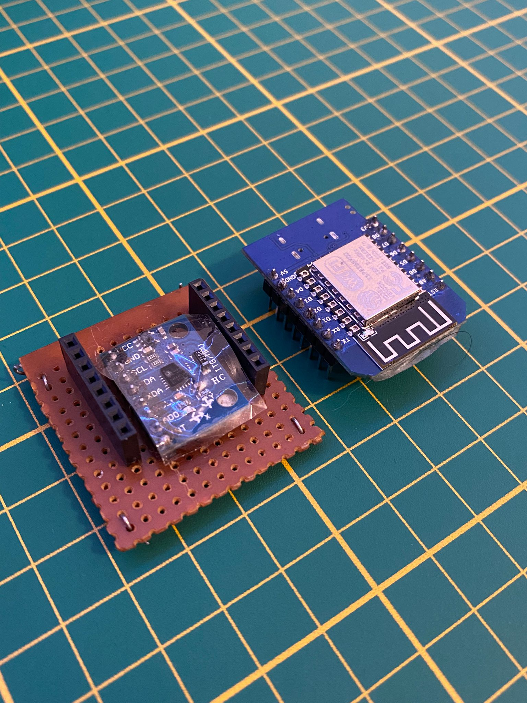
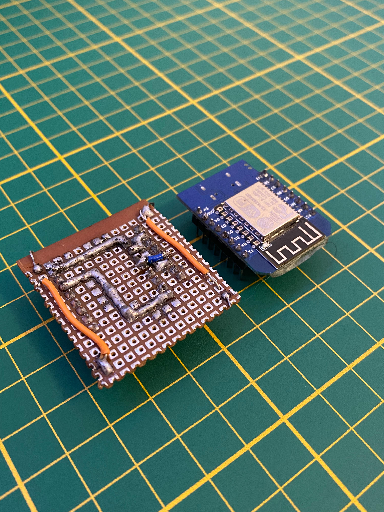
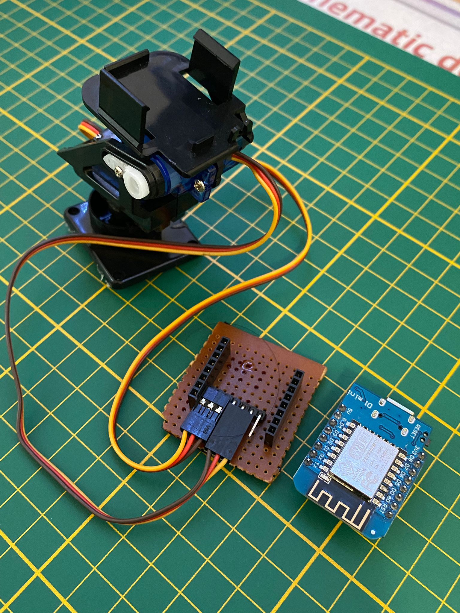

# Bikemuenchen-Head-Tracking-HeadLight

# 🎯 ESP8266 Head Tracking with MPU6050 + Pan-Tilt Servos

A wireless **head-tracking system** using **ESP8266 + MPU6050 + ESP-NOW** to control a **pan/tilt servo rig**.  
One ESP8266 acts as the **Sender** (reads orientation from MPU6050), the other as the **Receiver** (drives the servos).  

Author: [bikemuenchen](https://github.com/bikemuenchen)  
Project: **Bikemuenchen-Head-Tracking-HeadLight**

---

## ✨ Features
- Real-time yaw/pitch tracking with **MPU6050 DMP**  
- Wireless ESP-to-ESP communication using **ESP-NOW** (no router required)  
- Servo-based pan/tilt mechanism mimics head orientation  
- Debug mode available (`DEBUG 1`) for testing  

---

## 🧩 Hardware Required
- 2× ESP8266 boards (NodeMCU / Wemos D1 Mini)  
- 1× MPU6050 sensor module  
- 2× Micro servos (SG90 / MG90S)  
- Breadboard + jumper wires  

---

## 🔌 Wiring

### Sender (ESP8266 + MPU6050)
| MPU6050 | ESP8266 |
|---------|---------|
| VCC     | 3.3V    |
| GND     | GND     |
| SDA     | D2 (GPIO4) |
| SCL     | D1 (GPIO5) |
| INT     | D7 (GPIO13) |

### Receiver (ESP8266 + Servos)
| Servo   | ESP8266 |
|---------|---------|
| Pan Sig | D2 (GPIO4) |
| Tilt Sig| D1 (GPIO5) |
| VCC     | 5V (external) |
| GND     | GND (shared with ESP8266) |

---

## 📦 Dependencies

Please install the following Arduino libraries:

- [Servo](https://github.com/arduino-libraries/Servo)  
- [I2Cdevlib MPU6050](https://github.com/jrowberg/i2cdevlib/tree/master/Arduino/MPU6050)  

Make sure the **ESP8266 board package** is installed in Arduino IDE via Boards Manager.

---

## 🖥️ Setup Steps

1. **Get Receiver MAC Address**  
   - Upload and run [`ESP_Get_MAC.ino`](code/ESP_Get_MAC/ESP_Get_MAC.ino) on the **receiver ESP8266**.  
   - Open Serial Monitor and copy the displayed MAC address.  

2. **Update Sender Code**  
   - Open [`sender/sender.ino`](code/ESP8266_Sender_code/ESP8266_Sender_code.ino)  
   - Replace the default MAC in:  
     ```cpp
     uint8_t broadcastAddress[] = { ... }; 
     ```

3. **Upload Firmware**  
   - Flash the **receiver** first: [`receiver/receiver.ino`](code/ESP8266_Receive_code/ESP8266_Receive_code.ino)  
   - Then flash the **sender**.  

4. **Test**  
   - Power both boards.  
   - Move the MPU6050 → pan/tilt servos should follow.  

---

## 📐 Demo Video
- [Youtube](https://www.youtube.com/shorts/tne_76oB_q0)
- [Instagram](https://www.instagram.com/reel/DOG8mxtjeJE/?igsh=ZHh2eHZ5Znh1OGZ4)

---

## Project Photos
### **ESP8266 Sender Front** 



### **ESP8266 Sender Back** 


### **ESP8266_Receive**



## 🛡️ License
MIT License © 2025 [bikemuenchen](https://github.com/bikemuenchen)  

---

## 🙌 Credits
- MPU6050 DMP: [I2Cdevlib](https://github.com/jrowberg/i2cdevlib)  
- ESP-NOW examples from ESP8266 Arduino core  
- Project maintained by **bikemuenchen**  

---

## 💬 Support
If you get an error or face any problem, please write it in the **[Discussions](../../discussions)** section.
